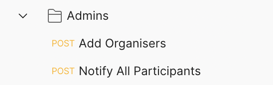
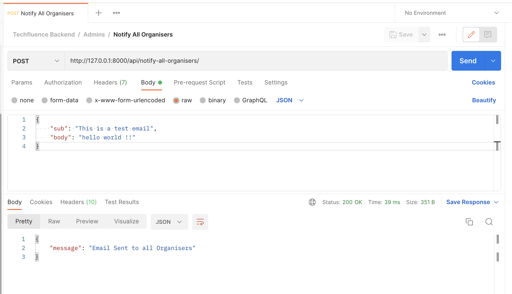

## Techfluence Backend

This is the backend for techfluence system. This is an event participation system, where in events are listed and particapants can fill in the form and participate. After the event, certificated would be auto-generated and send to the participants via email. Also the admins and organisers can send email notification to the participants. Admins and organisers can also download an excel sheet with all the details of the participants. This system reduces administration work and helps manage it in a faster and efficient way.


### 🔗 Content

* [Overview](#techfluence-backend)
* [Content](#-content)
* [Features](#-features)
* [Tech Stack](#-tech-stack)
* [API Reference](#-api-reference)
* [Environment Variables](#-environment-variables)
* [Run Locally](#-run-locally)
* [Documentation](#-documentation)
* [Screen-Shots](#-screen-shots)
* [Author](#-author)


### 📋 Features

- **EVENTS AND ORGANISERS :** Users can view all the listed events and thier respective organisers.

- **CONTACT US FORM :** User can fill up the Contact Us form. After form is submitted, they would recieve a corrospondace email(Auto Corrospondence email).

- **PARTICIPANTS NOTIFICATION :** System Admins and Event Organisers can send email notification to the participants.

- **CERTIFICATES GENERATING :** Event Organisers can generate certificates for the particiants and winners. Certificates can be downloaded (for printing) and sent the the participants (via email).

- **USER AUTHENTICATION :** Event Organisers and System Admins can verify thier Email ID, Login using email and password, make a Forgot request to reset thier password.

- **DOWNLOAD & BACKUP DATA :** System Admins and Event Organisers can download participants details (in the form of excel sheet) for verify during the event.


### 🧰 Tech Stack

Django, Django REST Framework *(Python)*


### 🛠 API Reference

**Postman Endpoints** : https://www.getpostman.com/collections/4c22378e29d8971262df




**API Endpoints JSON file** (for importing into thunderclient / postman) is available in the docs folder or click [here](docs/endpoints/endpoints.json)


### 🔐 Environment Variables

To run this project, you will need to add the following environment variables to your **.env** file

- `EMAIL_ID`  -  Email ID (which would be used to send emails)

- `EMAIL_PW`  -  Email Password


### 💻 Run Locally

***Step#1 : Clone Project Repository***

```bash
git clone https://github.com/atharvparkhe/techfluence-backend.git && cd techfluence-backend
```

***Step#2 : Create Virtual Environment***

- If *virtualenv* is not installed :
```bash
pip install virtualenv && virtualenv env
```
- **In Windows :**
```bash
env/Scripts/activate
```
- **In Linux or MacOS :**
```bash
source env/bin/activate
```

***Step#3 : Install Dependencies***

```bash
pip install --upgrade pip -r requirements.txt
```

***Step#4 : Add .env file***

- ENV file contents
    - **In Windows :**
    ```bash
        copy .env.example .env
    ```
    - **In Linux or MacOS :**
    ```bash
        cp .env.example .env
    ```
- Enter Your Credentials in the *".env"* file. Refer [Environment Variables](#-environment-variables)

***Step#5 : Run Server***

```bash
python manage.py runserver
```

*Check the terminal if any error.*


### 📄 Documentation

The docs folder contain all the project documentations and screenshots of the project.

**Local Server Base Link :** http://localhost:8000/

**Admin Pannel :**
- ***Email :*** "admin@admin.com"
- ***Password :*** "password"


### 🌄 Screen-Shots

**Particiants Section**


**Event Registration**


**Organisers Section**

- Authentication


- Main


**Admin Section**




**Other**


### 🙋🏻‍♂️ Author

**🤝 Connect with Atharva Parkhe**

[](https://www.linkedin.com/in/atharva-parkhe-3283b2202/)
[](https://www.github.com/atharvparkhe/)
[](https://www.twitter.com/atharvparkhe/)
[](https://www.instagram.com/atharvparkhe/)
[](https://leetcode.com/patharv777/)
[](https://www.youtube.com/channel/UChimOJO64hOqtE7HCgtiIig)
[](https://discord.gg/8WNC43Xsfc)
